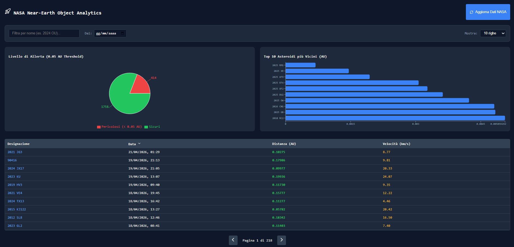

# NASA Near-Earth Object Analytics Dashboard

Una piattaforma per il monitoraggio, l'ingestione e l'analisi visiva degli asteroidi in avvicinamento alla Terra, basata sui dati ufficiali della NASA.

## Anteprima della Dashboard


---

## Funzionalità Principali

* **Dashboard Interattiva**: Un'interfaccia React a singola pagina che reagisce in tempo reale agli input dell'utente.
* **Visualizzazione Dati e Trend**: 
  * **Pie Chart**: Evidenzia il rapporto tra asteroidi sicuri e quelli "Potenzialmente Pericolosi" (soglia di attenzione impostata a 0.05 AU, standard astronomico per i PHA).
  * **Bar Chart**: Mostra i trend di prossimità per i 10 asteroidi più vicini in base ai filtri attivi.
* **Tabella Dinamica Avanzata**: 
  * Ricerca istantanea per designazione (nome).
  * Filtro temporale interattivo per escludere eventi passati.
  * Paginazione personalizzabile e ordinamento multi-colonna.
  * Formattazione condizionale (rosso/verde) per evidenziare immediatamente i fattori di rischio spaziale.
* **Data Pipeline Resiliente**: Script Python dedicato (`ingest.py`) per il download massivo dei dati NASA (fino a 5000 record storici e futuri).

---

## Stack Tecnologico

**Frontend:**
* React.js (Vite)
* Recharts (Data Visualization)
* Lucide-React (Iconografia)
* CSS inline per un tema scuro moderno (Tailwind-like)

**Backend & Data Pipeline:**
* Python 3
* Libreria `requests` (Integrazione API REST NASA)
* FastAPI (Endpoint per esporre i dati al frontend e triggerare il refresh)

**Database:**
* PostgreSQL (Hostato via Docker)
* Funzioni PL/pgSQL (`save_asteroid`, `save_approach`) per la validazione e l'inserimento relazionale dei dati.

---

## Architettura del Database
Il database è progettato per garantire efficienza e assenza di duplicati:
1. `asteroids`: Tabella anagrafica contenente Designazione e Magnitudine Assoluta.
2. `close_approaches`: Tabella degli eventi temporali contenente ID Asteroide, Data di avvicinamento, Distanza, Velocità.

---

## Guida all'Avvio (Local Environment)

Seguire questi passaggi per avviare l'intero stack sul proprio computer locale.

### Prerequisiti
* **Docker** e **Docker Compose** installati (per il database).
* **Python 3.10+** installato.
* **Node.js** e **npm** installati (per il frontend).

### 1. Avvia il Database (PostgreSQL)
Aprire il terminale nella cartella principale del progetto e lanciare il container Docker:

```bash
docker-compose up -d
```
(Nota: assicurarsi che il file `.env` sia configurato correttamente con le credenziali del database).

### 2. Configura e Avvia il Backend (Python / FastAPI)
Aprire un nuovo terminale, assicurarsi di essere nella cartella del backend e configurare l'ambiente Python:

```bash
# 1. Creazione e attivazione dell'ambiente virtuale
python3 -m venv .venv

# Su Windows usare: 
.venv\Scripts\activate
# Su Mac/Linux usare: 
source .venv/bin/activate

# 2. Installazione delle dipendenze necessarie
pip install -r requirements.txt

# 3. Popolazione del database con i dati NASA
python3 ingest.py

# 4. Avviamento del server backend FastAPI
uvicorn main:app --reload
```
(Il backend sarà ora in ascolto sulla porta `http://localhost:8000`).

### 3. Avvia la Dashboard (Frontend React)
Aprire un terzo terminale, spostarsi nella cartella del frontend e avviare l'interfaccia utente:

```bash
# Installazione dei pacchetti Node
npm install

# Avviamento del server di sviluppo Vite
npm run dev
```

Ora basterà cliccare sul link generato nel terminale (solitamente `http://localhost:5173`) per esplorare la Dashboard completa.